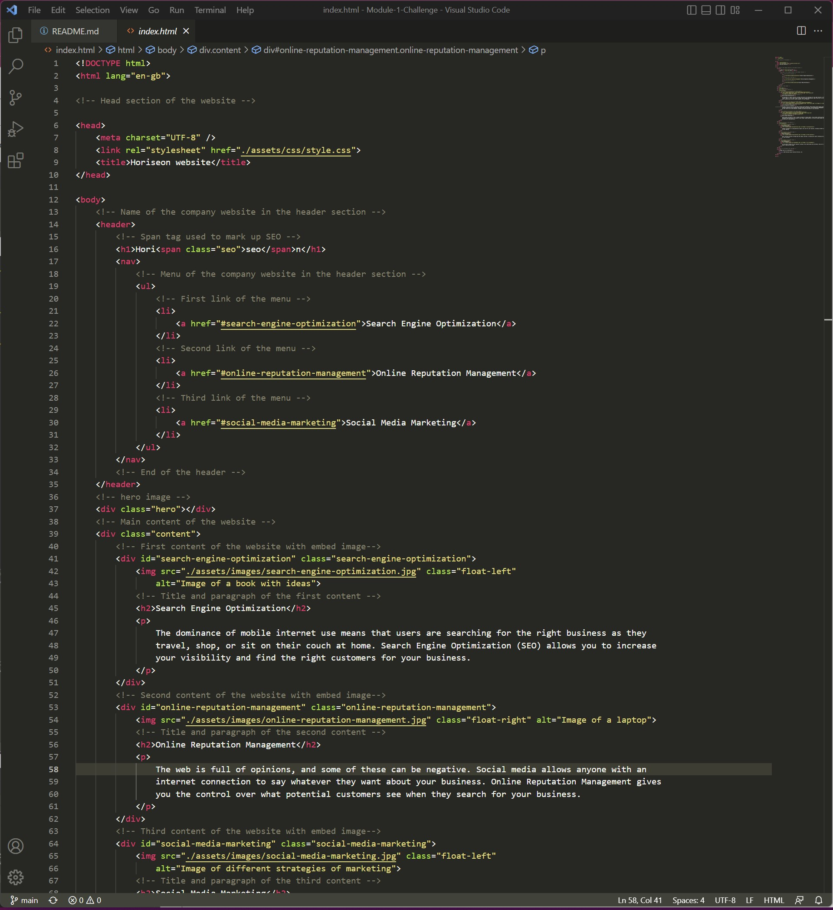

# Module-1-Challenge

## Description

This project was created to improve the **accesibility** of the website, so it is easier for other developers to know what the code do.

This is what I refactored of the existing code.

* Semantic HTML.
* HTML and CSS now follows a logical structure.
* All the images contain **alt** attributes.
* Headings attributes are in sequential order.
* Title elements contain a descriptive title.
* Comments to every tag of the code in HTML and CSS.

## Screenshots

The following screenshots are of the HTML and CSS code showing the reafactored code.

## Installation

N/A

## Usage

To access the website of the project [click here](https://puralex.github.io/Module-1-Challenge/)

## Credits

N/A

## Features

HTML and CSS were used to develop the website.
## Contributing

N/A

## Tests

I made some tests after putting HTML and CSS in logical stucture.

## License

Licensed under the MIT license.
